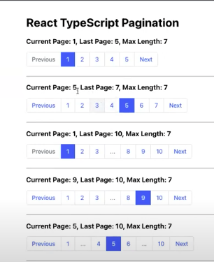
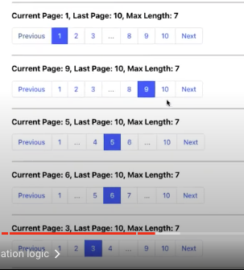

video tutorial: https://www.youtube.com/watch?v=ZBmAJTwalGQ
text tutorial: https://dominicarrojado.com/posts/how-to-create-your-own-pagination-in-react-and-typescript-with-tests-part-1/

PageLink -> номер страницы

aria-current -> Когда у вас есть группа связанных элементов, таких как несколько ссылок в навигационной цепочке или шагов в многоэтапном потоке, причем один элемент в группе имеет стиль, отличный от других, чтобы указать зрячему пользователю, что это текущий элемент в его group aria-current следует использовать для информирования пользователя вспомогательных технологий о том, что было указано с помощью стиля.

как сделать вывод пагинации
video: 00:36:00 logic in lib/pagination.ts

 

#Test
video tutorial: https://www.youtube.com/watch?v=FQA-6Nyr6kM&t=68s
text tutorial: https://dominicarrojado.com/posts/how-to-create-your-own-pagination-in-react-and-typescript-with-tests-part-2/

для тестов понадобиться
yarn add @faker-js/faker - помогает нам генерировать огромное количество поддельных (но реалистичных) данных для тестирования

https://fakerjs.dev/

ctrl + C останавливаем
запустить можно npm test
выйти Q
или yarn test --coverage
